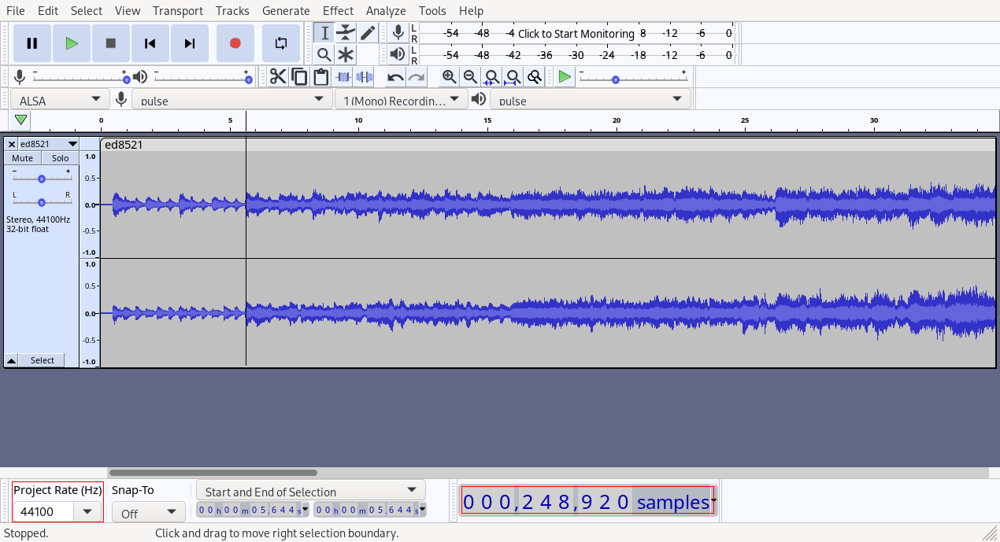

# General

The OST/BGM is stored as regular tracks in the game folder.
The exact format of the files varies between games, but any decent audio player should be able to play all them.

Each track has an intro and outro, which the game has to cut out in order to play them endlessly in a clean loop.
Information about the loop is stored in the metadata of each file.

If you want to replace the BGM, you can't just drop a file in place.
It has to match the format expected by the game (including sample rate) and should also contain the correct loop metadata.

The following formats are used:

| Game version | Folder (relative to install path) | Format | sample rate | loop metadata |
| ------------ | --------------------------------- | ------ | ----------- | ------------- |
| Sky trilogy (XSeed PC version) | `BGM` | OGG Vorbis (192kbps stereo) | 44.1kHz | `LOOPLENGTH=samples` & `LOOPSTART=sample` as OGG comments (can be changed e.g. with [vorbiscomment](https://wiki.xiph.org/Vorbis-tools) or [audacity](https://www.audacityteam.org/)) |
| Trails from Zero (NISA PC version) | `data_pc\bgm` | OGG Opus (192kbps stereo) | 48kHz | externally in `data\text\t_bgm._dt` (requires a hex editor)
| Trails of Cold Steel & ToCS II (XSeed PC version) | `data\bgm\wav` | WAV (16 bit stereo) | 48kHz | `smpl` RIFF chunk |
| Trails of Cold Steel III (NISA PC version) | `data\bgm\opus` | OGG Opus (stereo) | 48kHz | `loops=start_sample-end_sample` as OGG comment (can be changed e.g. with [opustools](https://opus-codec.org/downloads/)) |

# `smpl` chunk (Trails of Cold Steel & ToCS II)

The loop start and end sample is stored in the `.wav` file under a [RIFF](https://en.wikipedia.org/wiki/Resource_Interchange_File_Format) chunk `smpl`.
This chunk is 60 (0x3C) bytes long.
Start and end sample are 32 bit (4 byte) integers in little-endian byte order.
The start sample begins at offset 44 (0x2C) relative to the start of the `smpl` content, the end sample begins right after at offset 48 (0x30).


# How-To: Replace "Luxury Airship 'Lusitania'" with "The First Waltz"

In this guide, we will replace the track "Luxury Airship 'Lusitania'" which - as one may expect - plays aboard the Lusitania in Trails in the Sky the 3rd with "The First Waltz", which plays during Trails of Cold Steel III.
(This is only an illustrative example. The author does not wish to suggest that it is a good idea to do this in general.)

To follow along you will need:

- [audacity](https://www.audacityteam.org/)
- [opustools](https://opus-codec.org/downloads/)

The first step is to find which file is the right one for each track, which we can do by listening to them in order:
- "Luxury Airship 'Lusitania'" is: `ED6560.ogg`
- "The First Waltz" is: `ed8521.opus`

## Resampling

We need to reencode and resample the files.
As shown in the table above, we need the audio to be in OGG Vorbis format and sampled at 44.1kHz.

If we open "The first Waltz" in audacity, we can see that the sample rate of the file is 48kHz so we need to change it.


To do that, we select `Tracks > Resample` from the menu, choose a new sample rate of 44100 Hz and press Ok.


After a second or so, audacity should be done.
We can now theoretically export the file and use it in the game and it will play back, but we should do two more things:

First we need to adjust the audio balance because the "The First Waltz" is much quieter than "Luxury Airship 'Lusitania'".
We do this by first selecting the entire track with Ctrl+a and then amplifying via `Effect > Amplify`.
A value of +10dB is appropriate here, but this will vary based on the original track and the track that is to be replaced.

Second, we need to add loop metadata, but first we need to find the loop.

## Finding the loop

To find the loop information from the Cold Steel 3 track run `opusinfo ed8521.opus` in terminal:


The `User comments section` tells us the loop begins at sample number 270934 and ends at sample number 6238939.
Since we resampled the track, this will be incorrect because the sample number refers to the original sampling rate.
We can compute values for the new file by multiplying with the quotient of new and old sample rates: new_sample_number = old_sample_number * new_sample_rate / old_sample_rate.
In our case, that's 270934 * 44100 / 48000 = 248920 and 6238939 * 44100 / 48000 = 5732025.
For the vorbis files we also need the loop length which is the difference between the two, i.e. 5483105.

## Checking the loops

As an optional step, we can try and make sure that the loop information we got is correct.
This is especially important when attempting to find loops in tracks that don't have any metadata related to them.
Before doing this, make sure to save the project.

Navigate to the start of the frame, i.e. sample 248920.
Also make sure that the project sample rate matches the target sample rate of the track.



Then select everything before that sample and delete it.

Navigate to the end of the loop, i.e. sample 5483105 (after deleting the intro), then delete everything after.
Select all, duplicate the clip (Ctrl+c, select a position behind the end of the clip, Ctrl+v), move the clips together, and listen to the transition between the two.
If it doesn't sound right, the loop values are wrong.
If it does sound right, undo these changes and continue below.


## Adding the loop to the new file

Now we need to add the loop metadata.
In this case, we can do it directly in audacity:
Select `Edit > Metadata` from the menu and add tags `LOOPSTART` with value `248920` and `LOOPLENGTH` with value `5483105`.


## Finish

Now export the file via `File > Export > Export as OGG`.
The preset quality setting should be fine.
Rename the file to `ED6560.ogg`.

Now, make a backup and/or be ready to reinstall Sky the 3rd and copy the file in the BGM folder.
Start a new playthrough or load into the Lusitania and "The First Waltz" should playing and loop correctly.

## BGM Packs

In the Sky trilogy, there is an unannounced feature that allows having several different soundtracks and switching between them via ingame settings.

To enable this, instead of overwriting files in the `BGM` folder, create a new folder `BGM1` next to it (not inside!), and put your custom tracks inside this folder instead.
If not all tracks are replaced, the remainder will be taken from the original `BGM` folder.

If you then check the ingame settings, you should find that the *Background Music* setting no longer says "On", but "Original", and toggling it switches to "Unnamed Pack 1".
The name displayed in the menu can be customized by creating a file `BGM1/packname.txt` (max approx. 15 English letters or 7 Japanese letters, must be saved as Shift-JIS in the latter case).

This is not limited to `BGM1` only: you can also create `BGM2`, `BGM3`, et cetera, but the numbers have to be consecutive or they will not be found. The maximum number is `BGM999`.

# Useful programs & commands

## Sky

Either use audacity as shown above, or use [`oggenc`](https://wiki.xiph.org/Vorbis-tools) from the shell:

```
oggenc --comment LOOPSTART=1234 --comment LOOPLENGTH=567890 --bitrate 192k --resample 44100 -i input.wav -o output.ogg
```

If you just want to find the loops in these files, you can use `vorbiscomment` from the same source.

## Trails of Cold Steel & Trails of Cold Steel II

TODO

## Trails of Cold Steel III

Use [`opusenc`](https://opus-codec.org/downloads/) via the shell:

```
opusenc --comment loops=1234-567890 --bitrate 112 input.wav out.opus
```

`opusenc` cannot resample, so you have to do that with another program such as audacity.

If you just want to find the loops, use `opusinfo` from the same source.
